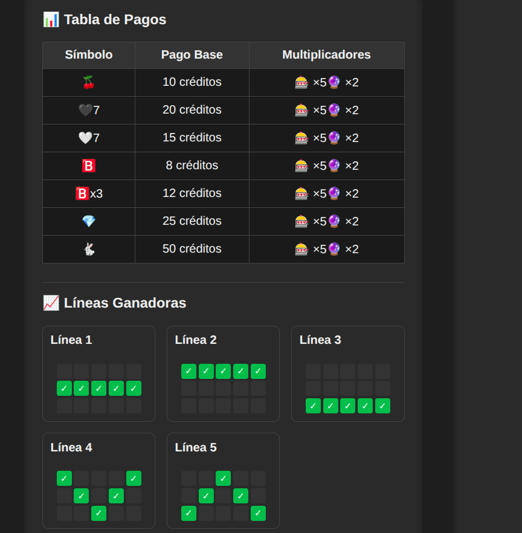
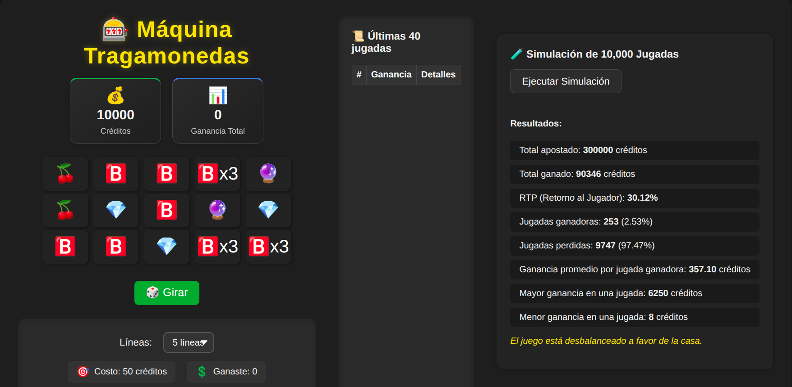

# Máquina Tragamonedas 🎰 — Guía de Uso y Análisis

Bienvenido a la **Máquina Tragamonedas**: un proyecto interactivo y educativo donde puedes jugar, ajustar parámetros y analizar el balance del juego a través de simulaciones automáticas.

---

## ¿Cómo se juega?

  

1. **Elige la cantidad de líneas**: Usa los controles para seleccionar cuántas líneas de pago quieres activar (Puedes elegir 1, 3 y 5).
2. **Apuesta**: Cada línea cuesta 10 créditos. El total apostado por jugada es `líneas x 10` es decir, 3 lineas 30 y 5 lineas 50.
3. **Haz girar**: Pulsa el botón "Girar" para lanzar la jugada. Se generará una cuadrícula aleatoria de símbolos.
4. **Revisa el resultado**: Si alguna de las líneas activas tiene una combinación ganadora según la tabla de pagos, recibirás el premio correspondiente.
5. **Consulta el historial**: A la derecha puedes ver el historial de jugadas, con los premios obtenidos y las combinaciones ganadoras.

La experiencia está pensada para ser clara y visual, mostrando siempre tus créditos, el último premio y el total acumulado.

---

## Panel de Simulación: Analiza el Balance del Juego

  

Además de jugar manualmente, puedes analizar el comportamiento estadístico de la máquina usando la **Simulación de 10,000 Jugadas**:

- Accede a la sección "Simulación de 10,000 Jugadas".
- Haz clic en "Ejecutar Simulación".
- El sistema realizará automáticamente 10,000 jugadas con la configuración actual (5 líneas, 10 créditos por línea).
- Se mostrarán estadísticas clave: total apostado, total ganado, RTP, porcentaje de jugadas ganadoras y perdidas, ganancia máxima y mínima, etc.

Esto te permite ver si el juego está equilibrado y cómo se comporta a largo plazo.

---

## ¿Qué mide la simulación?

En cada simulación automática se recopilan los siguientes datos:

- **Total apostado** y **total ganado**.
- **Número de jugadas ganadoras** y **perdidas**.
- **Ganancia máxima** y **mínima** en una jugada.
- **RTP (Return to Player)**: porcentaje de retorno al jugador.
- **Porcentaje de jugadas ganadoras**.

El objetivo es **analizar el balance y la aleatoriedad** del juego, y comprobar si la máquina es justa tanto para el jugador como para la "casa".

---

## Interpretando los resultados

### ¿El juego está equilibrado?

El principal indicador es el **RTP (Return to Player)**, que suele estar entre 90% y 100% en la simulación, lo que significa que el juego está **razonablemente balanceado**: la casa tiene una ligera ventaja, pero el jugador puede tener rachas de suerte.

- **RTP > 100%**: El juego favorece al jugador (no recomendable para el casino).
- **RTP < 90%**: El juego es muy difícil y puede ser frustrante.
- **RTP entre 90% y 98%**: Es lo habitual en tragamonedas reales y se considera justo.

### ¿Con qué frecuencia se gana?

El porcentaje de jugadas ganadoras suele estar entre **20% y 35%**, es decir, aproximadamente 1 de cada 4 o 5 jugadas resulta en algún premio.

---

## ¿Qué es el RTP y por qué importa?

El **RTP (Return to Player)** indica el porcentaje del total apostado que la máquina devuelve a los jugadores a largo plazo. Por ejemplo, un RTP del 95% significa que, por cada 100 créditos apostados, la máquina devuelve 95 en premios (en promedio).

- **RTP alto**: Más atractivo para el jugador, menos rentable para el casino.
- **RTP bajo**: Más rentable para el casino, pero puede alejar a los jugadores.

En este proyecto, el RTP se calcula automáticamente tras la simulación y se muestra en pantalla.

---

## ¿Cómo probar la simulación?

1. **Ejecuta la aplicación** (por ejemplo, con `npm run dev`).
2. Ve a la sección "Simulación de 10,000 Jugadas".
3. Haz clic en "Ejecutar Simulación".
4. Observa los resultados y analiza el balance del juego.

Puedes repetir la simulación varias veces para ver cómo varían los resultados por azar.

---

## ¿Cómo ajustar la dificultad o el balance?

Puedes modificar el balance del juego cambiando:

- **La tabla de pagos**: Ajusta los premios por combinación.
- **La cantidad de líneas jugadas**: Permite al jugador elegir más o menos líneas.
- **La lógica de generación de símbolos**: Cambia la probabilidad de aparición de cada símbolo.

Estos cambios afectan directamente el RTP y la experiencia del jugador.

---

## Conclusión

Esta máquina tragamonedas es un ejemplo educativo para analizar el balance y la aleatoriedad en juegos de azar. La simulación te permite experimentar con diferentes configuraciones y ver cómo afectan al RTP y a la experiencia del usuario.

---
